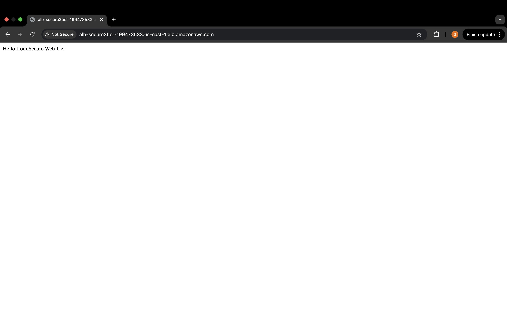
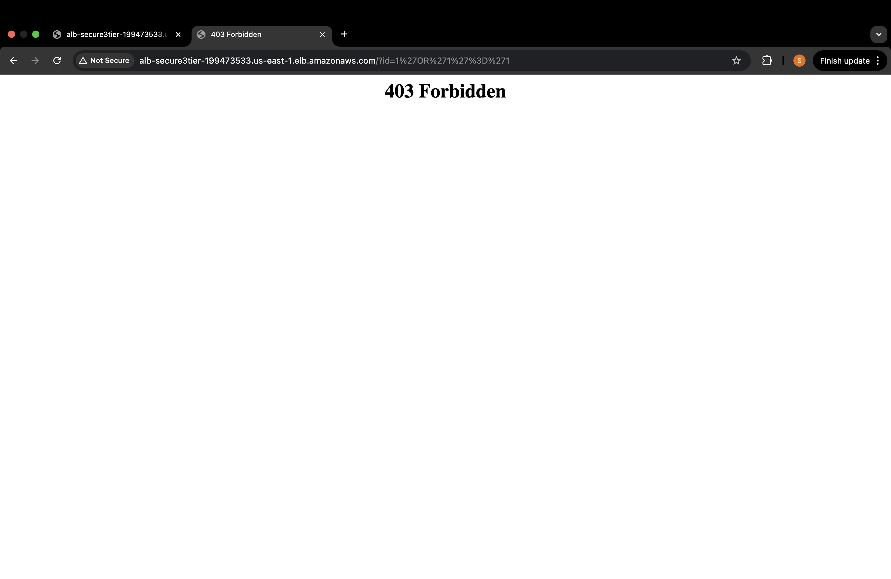
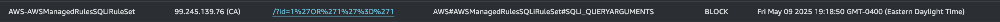

# Secure-by-Default AWS Three-Tier Landing Zone

A Terraform module that stands up a fully audited, CIS-aligned three-tier network on AWS:

### Features

1. **Network Foundation**  
   - Dedicated VPC (CIS 1.1)  
   - Public, Private App & Multi-AZ DB Subnets (CIS 2.1, 2.4)

2. **Security**  
   - IGW + explicit 0.0.0.0/0 route (CIS 3.1, 3.3)  
   - Web (80/443), App (5000), DB (3306) Security Groups (CIS 4.1, 4.3)

3. **Compute**  
   - `t2.micro` EC2 for Web and App tiers  
   - Multi-AZ RDS MySQL (`db.t3.micro`, free tier)

4. **Logging & Audit**  
   - CloudTrail (multi-region, file validation) (CIS 2.1, 2.2)  
   - VPC Flow Logs (web subnet only) (CIS 3.2)

5. **Cost Guardrail**  
   - CAD $5 / USD $4 monthly alert

6. **One-Hour Demo (Optional)**  
   - Application Load Balancer + AWS WAF with SQL-i protection (403 response)

7. **Compliance Evidence**  
   - Inline `# CIS_x_y` tags + auto-generated [`controls.md`](./controls.md)

8. **CI/CD Workflow**  
   - GitHub Actions: format check & Terraform plan

---

## 📁 Project Structure

```
secure-3tier/
├── main.tf
├── outputs.tf
├── variables.tf
├── versions.tf
├── controls.md            # Auto-generated CIS control table
├── scripts/
│   └── gen_cis_table.py   # CIS control generator
└── .github/
    └── workflows/tf.yml   # Terraform CI workflow
```

---

## Getting Started

### 1. Clone the repo

```bash
gh repo clone secure-3tier --public
cd secure-3tier
git commit --allow-empty -m "chore: init repo"
git push --set-upstream origin main
```

### 2. Initialize and apply

```bash
terraform init
terraform plan
terraform apply --auto-approve
```

### 3. Output values

```bash
terraform output
# You'll get:
# - Web EC2 public IP
# - App EC2 private IP
# - RDS DB endpoint
```

---

## Test Connectivity

```bash
curl http://$(terraform output -raw web_public_ip)
# → Hello from Secure Web Tier

curl http://$(terraform output -raw app_private_ip):5000
# → Hello from App (run from Web EC2)

nc -zv $(terraform output -raw db_endpoint) 3306
# → times out on laptop, succeeds on App EC2
```

---

## ALB + WAF SQL-i Demo

### 1. Create an ALB pointing to your web EC2 (port 80)  
### 2. Open the ALB URL in a browser



### 3. Create WAF Web ACL with **AWSManagedRulesSQLiRuleSet**  
Associate with the ALB.

### 4. Trigger a SQL injection attempt

```bash
curl "http://<ALB_DNS>/?id=1'OR'1'='1"
# → 403 Forbidden
```



### 5. Check WAF logs



#### 📁 Image Path
Make sure the images are stored at:
```
secure-3tier/
└── docs/
    └── images/
        ├── fig1.png
        ├── fig2.png
        └── fig3.png
```

---

## CIS Compliance Mapping

Generate the table by running:

```bash
python3 scripts/gen_cis_table.py
```

Then view [`controls.md`](./controls.md) for a searchable map of all `# CIS_x_y` tags in your Terraform code.

---

## CI/CD

Create a GitHub Actions workflow at `.github/workflows/tf.yml`:

```yaml
name: Terraform CI
on: [pull_request]
jobs:
  fmt-plan:
    runs-on: ubuntu-latest
    steps:
      - uses: actions/checkout@v4
      - uses: hashicorp/setup-terraform@v3
        with:
          terraform_version: 1.7.5
      - run: terraform fmt -check
      - run: terraform init
      - run: terraform plan -no-color
```

---

## Cleanup

To avoid AWS charges:

```bash
terraform destroy --auto-approve
```

If you ran the ALB + WAF demo, also clean up the extra resources:

```bash
bash scripts/cleanup_demo.sh
```

---